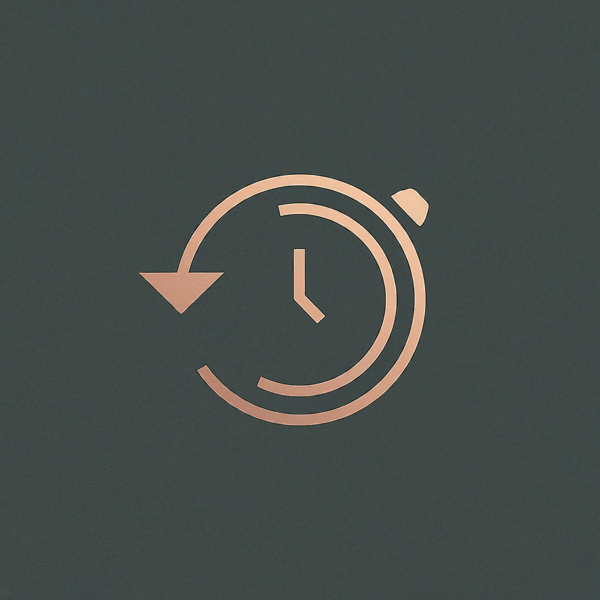

 

    

<h3 align="center">ChronoCraft</h3>

  

    Crafting Data into Stories, One Timeline at a Time
     
    <a href="path/to/demo">Demo Link</a>
  

<!-- TABLE OF CONTENTS -->

  
Table of Contents

  <ol>
    <li>
      <a href="#about-the-project">About The Project</a>
      <ul>
        <li><a href="#built-with">Built With</a></li>
      </ul>
    </li>
    <li>
    <a href="#introduction">Introduction</a>
    <ul>
      <li><a href="#inspiration">Inspiration</a></li>
      <li><a href="#what-it-does">What It Does</a></li>
      <li><a href="#how-we-built-it">How We Built It</a></li>
      <li><a href="#challenges">Challenges We Ran Into</a></li>
      <li><a href="#future-plans">Future Plans for ChronoCraft</a></li>
      <li><a href="#team">About the Team</a></li>
    </ul>
    </li>
    <li><a href="#getting-started">Getting Started</a></li>
    <li><a href="#usage">Usage</a></li>
    <li><a href="#roadmap">Roadmap</a></li>
    <li><a href="#contributing">Contributing</a></li>
    <li><a href="#license">License</a></li>
    <li><a href="#contact">Contact</a></li>
    <li><a href="#acknowledgments">Acknowledgments</a></li>
  </ol>

---

## Introduction
In this hackathon project proposal, we present ChronoCraft, a timeline creation software that generates timelines for a given dataset. Our team aims to provide a user-friendly tool that allows users to visualize and analyze chronological data in a meaningful way.

## 💡 Inspiration 💡
Our inspiration for ChronoCraft comes from the need to effectively visualize and analyze chronological data. We noticed that existing timeline creation tools often lack user-friendly interfaces and automation capabilities. We aim to address these limitations by developing a software that not only generates timelines based on the provided dataset, but also allows users to easily customize and annotate them. By simplifying the process of creating timelines, we hope to empower users to gain valuable insights from their chronological data.

## ⚙️ What It Does ⚙️
Our main objectives for ChronoCraft are:
- Develop an intuitive and interactive user interface for creating and customizing timelines.
- Implement algorithms to automatically generate timelines based on the provided dataset.
- Enable users to add events, milestones, and annotations to the generated timelines.
- Provide options for customizing the appearance and layout of the timelines.

## 🛠️ How We Built It 🛠️
To achieve our objectives, we will follow these steps:
1. Research and analyze existing timeline creation tools and libraries.
2. Design and develop the core functionality of ChronoCraft, including data parsing, timeline generation, and user interface components.
3. Implement algorithms to handle different types of chronological data, such as dates, durations, and intervals.
4. Test and refine the software to ensure accuracy and usability with Sauce Labs.
5. Document the development process and provide clear instructions for users.

##  ⚠️ Challenges we ran into ⚠️
*Some challenges*

## ⏭️ Future Plans for ChronoCraft ⏭️
While our initial focus is on creating a functional prototype for the hackathon, we have ambitious plans for the future of ChronoCraft. Some of our future plans include:
- Scaling the application to a larger user base and integrating with platforms like Wikipedia, allowing for the chronological ordering of information.
- Partnership with Adobe Express; enhancing the software with advanced visualization options such as interactive charts and graphs.
- Integrating with external data sources to automatically populate timelines with relevant information.
- Adding collaboration features to allow multiple users to work on the same timeline simultaneously.
- Expanding the software to support different languages and localization.

## 💙 About the Team 💙
Hossein Molavi, a third-year Computer Engineering student at the University of Waterloo, is deeply fascinated by the intricate dance between computer hardware and software algorithms. His passion lies in exploring frontiers where these realms converge

Amin

Beomsoo

Abtin

--- 
\
ChronoCraft aims to simplify the process of creating timelines and provide a powerful tool for visualizing chronological data. We are excited about the potential of this project and look forward to bringing it to life during the hackathon.

If you have any questions or suggestions, please feel free to reach out to us. We appreciate your support and interest in ChronoCraft!
